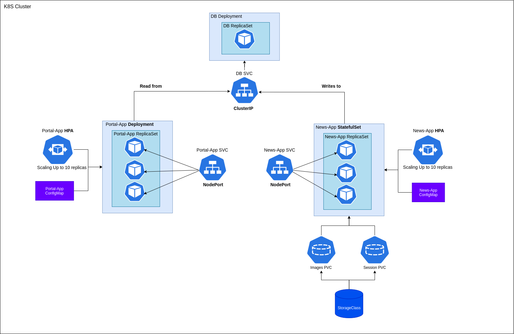

## News APP Cluster

---

### This repo contains the **News APP** K8S Cluster

It's a simple study app with just three applications:

- News App (The write application);
- Portal App (The read application);
- DB (The database)

The topics implemented in this project includes:

- Pods (Resources, Liveness and Readiness Probes);
- ReplicaSets;
- Deployments (Rollbacks, Rolling updates, Rolling history);
- StatefulSets (Persistence with PVC's);
- ConfigMaps;
- Services (NodePort, ClusterIP);
- Horizontal Pod Autoscaler;
- Volumes and Persistent Volumes Claims;
- Storage Classes;

---

### High-Level architecture overview:

